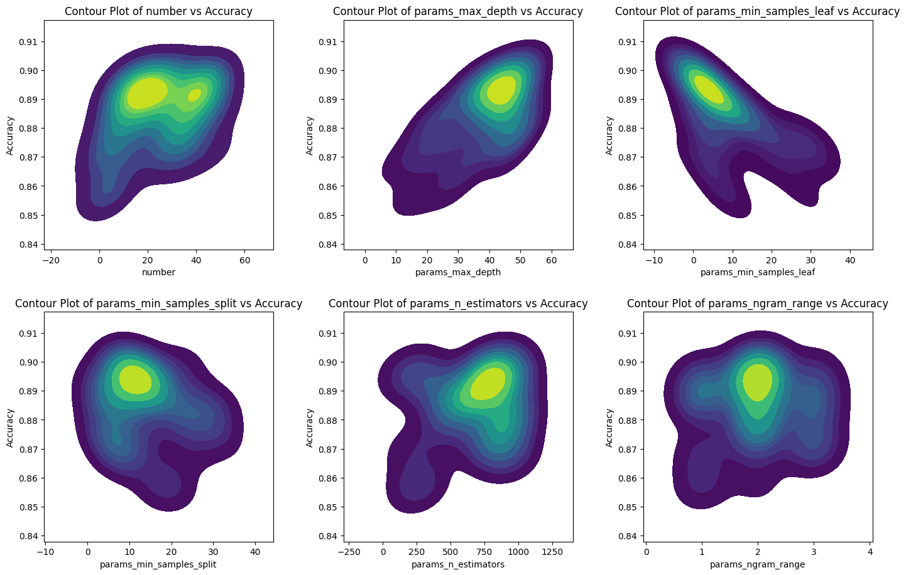
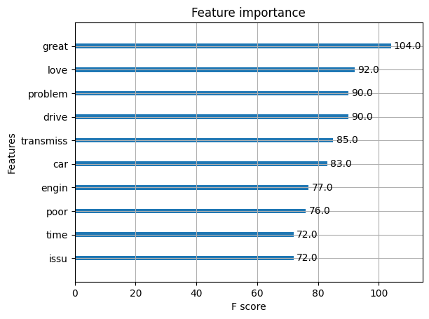

# Binary Classification

## Introduction

Some preliminary EDA on our dataset highlighted the potential for Binary Classification. In order to achieve the best possible classification result, I would like to approach Binary Classification by asking three questions:
1. What is the best way to split the data?
2. What is the best algorithm for a binary dataset?
3. What parameters deliver the best results for the selected algorithm?

This document summarizes the methodologies, results, and insights gained during the process.

After I started this project, I explored new libraries and techniques - and hence, you will see different methods being used for same sections across different algorithms. 

---

## Part 1: Best Way to Split Data

### Background & Results

I thought of four different approaches for splitting our data. For each of these approaches, I used the Multinomial Naive Bayes algorithm as a base algorithm for comparison. I also used the ROC-AUC score for all different methods. 
  
The ROC-AUC score represents the area under the Receiver-Operating Characteristic Curve. The ROC curve essentially plots the true positive rates against the false positive rates. Hence, it can be thought of as a function of sensitivity to false positive rates. The curve shows this ratio across all possible threshold levels. It allows use to measure the model’s ability to distinguish between positive and negative classes, despite the frequencies of either class. Hence, it serves as a good standard of measure for judging the best approach at splitting data.

Additionally, for each of the approaches, I trained the hyperparameters using GridSearchCV from the Sci-kit learn library in Python. More details given further down. 

### Approaches:

#### **Approach 1**: Use all 5 classes equally. Used the same amount of datapoints for all classes. 
- Accuracy for 1: 0.6118
- Accuracy for 2: 0.3250
- Accuracy for 3: 0.3225
- Accuracy for 4: 0.4553
- Accuracy for 5: 0.6134
- ROC-AUC Score: 0.8111
- Observations: Poor distinction between Ratings 2 and 3. It might be because the algorithm is over-predicting Ratings 1 and 5, and misclassifying the middle ratings. 

#### **Approach 2**: Split into 3 classes: `pos` (1 & 2), `neutral` (3), and `neg` (4 & 5). Adjusted for class imbalance by oversampling Rating 3 (neutral).
- Accuracy for pos: 0.7193
- Accuracy for neutral: 0.4286
- Accuracy for neg: 0.8425
- ROC-AUC Score: 0.8382
- Observations: Neutral reviews were least accurate. Most likely because they were misclassified as Rating 2 or 4.

#### **Approach 3**: Binary split: `neg` (1, 2, 3) and `pos` (4, 5). 
- Accuracy for pos: 0.8408
- Accuracy for neg: 0.8878
- ROC-AUC Score: 0.9335

#### **Approach 4**: Binary split: `neg` (1, 2) and `pos` (4, 5), excluding Rating 3.
- Accuracy for pos: 0.9054
- Accuracy for neg: 0.9028
- ROC-AUC Score: 0.9637
- Observations: Approach 3 and 4 were competitive options for the same idea - Binary classification. From the results, Approach 4 looks like the best bet. However, using Approach 3 would make more sense in some other applications. 

### Additional Details

Since we were using the Multinomial NB algorithm, I decided to create a bag of words using Sci-kit learn's `TfidfVectorizer`, which like the name suggests, creates a sparse TF-IDF representation of our data. `TfidfVectorizer` has the ability to choose the size of n-grams to be considered and the size of its feature space. Hence, I treated these two as hyperparameters that can be tested on using `GridSearchCV`. 

Sci-kit learn’s `MultinomialNB` also allows us to choose the learning rate alpha during the fitting process - which I treated as an additional hyperparameter. To streamline the process for `GridSearchCV`, I utilized Sci-kit learn’s `Pipeline` function to combine `TfidfVectorizer` and `MultinomialNB` into one callable function.

Generally speaking, these are the hyperparameters that we tested on:

- **Ngram range**: 1-gram, 2-gram and 3-gram. (Adding higher grams would be computationally expensive and cause overfitting)
- **Max features**: 3000, 5000, 7000, 10000. (Since we used about 10000 samples from each class, using 30%, 50%, 70% and equal amount of features seemed appropriate)
- **Alpha**: 0.1, 0.5, 1 (Learning rate of 10 was added as a fail safe measure to overfitting in the first example. But removed in later approaches) 

### Results Summary

The best approach - and the approach that I will be using going onwards - is to split data such that ratings of 1 & 2 count as negative and 3 & 4 as positive. The best parameters were alpha = 0.1, max features = 10000 and ngram = 2, which achieved an F1 score of **0.9036** on **training set** and **0.9041** on **test set**! 

---

## Part 2: Logistic Regression and Linear Support Vector Machines

For this part, I tried out the Logistic Regression and Linear SVM algorithms using the same TF-IDF Vectorizer as above, but used on Approach 4 - {1, 2} -> ‘neg’ and {4, 5} -> ‘pos’. I tested out three different algorithms for this:
-	Logistic Regression
-	Linear Support Vector Machines (SVMs)
-	Logistic Regression using custom Word2Vec Embeddings

### Logistic Regression

For this algorithm, I used Sci-kit learn’s inbuilt `LogisticRegression` function. This function is incredibly flexible and allows users a lot of options when it comes to parameter selection. From Sci-kit’s page, here is the function:

class sklearn.linear_model.LogisticRegression(penalty='l2', *, dual=False, tol=0.0001, C=1.0, fit_intercept=True, intercept_scaling=1, class_weight=None, random_state=None, solver='lbfgs', max_iter=100, multi_class='deprecated', verbose=0, warm_start=False, n_jobs=None, l1_ratio=None)

The penalty function allows us to choose a regularization function between L1, L2 and a third option - ‘ElasticNet’. `ElasticNet` is simply just L1 and L2 added together with weights assigned to them. This weight can be controlled using the parameter ‘l1_ratio’. Given the fact that we have about `35000` datapoints and `~7000` features, I will use elastic net with variable l1 ratio to get the best possible regularization. 

The ‘solver’ function has the following options:

| Solver              | Penalty                     | Multinomial Multiclass |
|---------------------|-----------------------------|-------------------------|
| `lbfgs`             | `l2`, None                 | yes                     |
| `liblinear`         | `l1`, `l2`                 | no                      |
| `newton-cg`         | `l2`, None                 | yes                     |
| `newton-cholesky`   | `l2`, None                 | no                      |
| `sag`               | `l2`, None                 | yes                     |
| `saga`              | `elasticnet`, `l1`, `l2`, None | yes                  |

Since we chose to `ElasticNet`, our only option is to use the `saga` solver, which is a variant of the Stochastic Average Gradient Descent Loss function. `saga` is also really good for sparse datasets like the ones we are working with. 

Hence, following are the list of hyperparameters that were used to tune our algorithm using `GridSearchCV`. 

- `Ngram range`: 1-gram, 2-gram and 3-gram. (Adding higher grams would be computationally expensive and cause overfitting)
- `C`: 0.01, 0.1, 1, 10. (The inverse of regularization strength. Once a regularization function is determined, C determines how strong it’s effect will be). 
- `l1_ratio`: 0.1, 0.5, 0.9  (0.1 would turn ElasticNet into a L2-heavy regularization function and 0.9 will turn it into a L1-heavy regularization function. 0.5 strikes a balance between the two).

After running the code on above parameters/hyperparameters, we achieved the best f1 score of `0.9206` on the **training set** for `C` = 1, `l1_ratio` = 0.1 and `ngram` = 3. These parameters achieved an F1 score of `0.9289` on the **test set**. 

Hence, trigrams with a simple L2 penalty function without any inverse weighting would give us best results. 

### Linear Support Vector Machines (SVM)

Again, I use sci-kit learn’s inbuilt `LinearSVC` function. Just like Logistic Regression, this function also has a lot of flexible parameters:

class sklearn.svm.LinearSVC(penalty='l2', loss='squared_hinge', *, dual='auto', tol=0.0001, C=1.0, multi_class='ovr', fit_intercept=True, intercept_scaling=1, class_weight=None, verbose=0, random_state=None, max_iter=1000)

Unlike Logistic Regression, there is no option to use an `ElasticNet` penalty function, so I treated the penalty function as a hyperparameter to be tuned. The loss function stayed `saga` and `C` had the same range as before. Hence the set of hyperparameters for this algorithms is:

- `Ngram range`: 1-gram, 2-gram and 3-gram. (Adding higher grams would be computationally expensive and cause overfitting)
- `C`: 0.01, 0.1, 1, 10. The inverse of regularization strength. Once a regularization function is determined, C determines how strong it’s effect will be. 
- `Penalty`: L1, L2 - the two available regularization functions.

The parameters that achieved the best result are `C` = 0.1, `penalty` = L2, `ngram` = 2, which achieved an F1 score of `0.9308` on our **test set**. 

### Logistic Regression with Word2Vec Embeddings

For this algorithm, instead of using the classic TF-IDF bag of words, I am using custom **Word2Vec** Embeddings. Word2vec is a machine learning algorithm that converts words into multidimensional vectors to represent their meaning and relationships in a way that computers can understand. To do this efficiently, I used the `Word2Vec` function provided by the `Gensim` library. 

This function also allows us to see what words are ‘close’ to each other in the multidimensional vector representation. For example, the words closest to ‘car’ in our dataset are:

('vehicle', 0.7477720379829407), ('vechile', 0.7187308669090271), ('carit', 0.7181493043899536), ('cari', 0.6730164885520935), ('itit', 0.6641161441802979)

The numbers in brackets is just a metric to show how ‘close’ the words are to ‘car’ and takes values between 0 and 1.

Now, since each word has it’s own multidimensional vector representation, and our bag of words has several words as features for each datapoint, we had to figure out a way to create one single multi-dimensional representation for each datapoint. We do this by taking the **average** of Word2Vec embeddings for a given datapoint into one single usable vector. We then use this average to train our data. 

Using this method on Logistic Regression, we achieved an F1 score of `0.9041`. While the accuracy has gone lower, **the time taken to run this model has been cut down to a third of its original (from 126 sec to 40 sec)**.

---

## Part 3: Tree-Based Algorithms - Random Forests, XGBoost and Ensemble Methods

Tree-based algorithms are a bit slower than Linear algorithms. However, the decision structure formed by these algorithms can give us a lot of insights into feature importance. For this section, I will be considering the following tree-based algorithms:
-	Random Forests
-	XGBoost
-	Ensemble methods
-	(Best algorithm) with custom Word2Vec Embeddings

### Random Forests

Just like the previous algorithms, I decided to stick with Sci-kit learn’s `RandomForest` classifier function and used TF-IDF Vectors as input again. Random forest allows for A LOT of parameters to be tuned. To optimize the performance here, I decided to consider the following parameters for tuning:

**N_estimators**: the number of trees created in our forest, 

**max_depth**: The maximum allowed depth of our tree, 

**min_samples_split**: Minimum number of samples required before splitting, 

**min_samples_leaf**: Minimum number of samples required in leaf nodes, 

**max_features**: Maximum number of features considered for splitting data, 

**ngram_max**: ngrams to be considered for feature generation. 

Each one of the above parameters have a dozen values that can be tested out - using `GridSearchCV` could be extremely time consuming, since it will test out `n^m` possibilities where `n` is the number of possible values in each features and `m` is the number of features. Hence, we use a different method to optimize our algorithm - **Bayesian optimization**. 

Specifically, we will use the `Optuna` Library and their `TPESampler` which stands for Tree-structure Parzen (TPE) Sampler. The way TPE Approach works is that it takes in a sample space that looks as follows:

`n_estimators` = trial.suggest_int('n_estimators', 100, 1000)

`max_features` = trial.suggest_categorical('max_features', ['sqrt', 'log2'])

So instead of choosing values from a list, we assign an entire uniform distribution of values between a certain range. (Alternatively, we can also assign a list of values, just like before. But `Optuna` applies equal prior probability of being chosen to all items in that list.) From then on, when the model starts training, `TPESampler` takes over and makes the following changes in the search space: uniform → truncated Gaussian mixture, log-uniform → exponentiated truncated Gaussian mixture, categorical → re-weighted categorical. The probability space is built based on observations made in the non-parametric densities. 

Since `TPESampler` is an optimization algorithm, if we were to look at the values chosen by the Sampler, we could potentially observe a preference for values in a certain range. Hence, this would allow us to start our search with a much larger range, and then narrow down the search space based on TPE’s ‘preference’. Hence, I first ran just 50 trials on the below parameters:

`n_estimators` = trial.suggest_int('n_estimators', 100, 1000)

`max_depth` = trial.suggest_int('max_depth', 10, 50)

`min_samples_split` = trial.suggest_int('min_samples_split', 2, 32)

`min_samples_leaf` = trial.suggest_int('min_samples_leaf', 1, 32)

`max_features` = trial.suggest_categorical('max_features', ['sqrt', 'log2'])

`ngram_max` = trial.suggest_int('ngram_range', 1, 3)

In the first 50 trials, I saw the following pattern:

In the above diagram, we can see that:

`ngrams`: bigrams seem to be preferred over unigrams and trigrams.

`max_features`: sqrt(n) seems to have been prioritized.

`n_estimators`: higher number of trees are preferred, so the new range is (420, 940)

`max-depth`: Higher depth is preferred, so the new range is (35, 50)

`min_samples_split` and `min_samples_leaf` can be narrowed down to (5, 20) and (1, 15) respectively. 

After 100 more trials in the narrower space, we achieved a score of `0.8999` on the **training set** and `0.8986` on the **test set**. The ‘optimal’ parameters chosen were: `n_estimators` = 551, `max_depth` = 48, `min_samples_split` = 7, `min_samples_leaf` = 1. 

### XGBoost

Sci-kit Learn’s `XGBoostClassifier` allows for even more parameters to be tuned. Yet again, I chose `Optuna` to narrow down the feature space. Here are the parameters and the range that I initially chose to explore using `Optuna`:

`n_estimators` = trial.suggest_int('n_estimators', 100, 600)

`max_depth` = trial.suggest_int('max_depth', 10, 50)

`learning_rate` = trial.suggest_float('learning_rate', 0.01, 0.3)

`subsample` = trial.suggest_float('subsample', 0.6, 1)

`colsample_bytree` = trial.suggest_float('colsample_bytree', 0.6, 1)

`gamma` = trial.suggest_float('gamma', 0, 5)

`reg_alpha` = trial.suggest_float('reg_alpha', 0, 1)

`reg_lambda` = trial.suggest_int('reg_lambda', 1, 10)

`ngram_max` = trial.suggest_int('ngram_range', 1, 3)

I repeated the same process again and got the following contour plot:

It seems like bigrams and `colsample_bytree` = 0.75 were the optimal values that were chosen in initial trials. For the other parameters, the parameter space can be narrowed down as follows:

`n_estimators` = trial.suggest_int('n_estimators', 250, 900)

`max_depth` = trial.suggest_int('max_depth', 10, 35)

`learning_rate` = trial.suggest_float('learning_rate', 0.1, 0.3)

`subsample` = trial.suggest_float('subsample', 0.6, 1)

`gamma` = trial.suggest_float('gamma', 1, 4)

`reg_alpha` = trial.suggest_float('reg_alpha', 0, 0.6)

`reg_lambda` = trial.suggest_float('reg_lambda', 1, 7)

If we take another look at the contour plot, we can notice that TPESampler has pretty much chosen the optimal value for all of our parameters in the above ranges:

After 150 trials, we achieved an F1 score of `0.9228` on the **training set**. This score was achieved for the following parameters:  

`n_estimators` = 900, `max_depth` = 11, `learning_rate` = 0.1, `subsample` = 0.9, `colsample_bytree` = 0.75, `gamma` = 2.775, `reg_alpha` = 0.4, `reg_lambda` = 2. 

Overall this XGBoost forest is quite massive and although it achieved an F1 score of `0.9134` on the **test set**, it took a total of **91 seconds** to run. We can use a smaller version of the above model ran on just 350 trees, that achieves similar accuracy and takes almost half the time to run:

With the following parameters, we can achieve a score of `0.9103` on the test set in **54 seconds**.

`n_estimators` = 350, `max_depth` = 15, `learning_rate` = 0.17, `subsample` = 0.9, `colsample_bytree` = 0.75, `gamma` = 2.775, `reg_alpha` = 0.5, `reg_lambda` = 2.5. 

### Ensemble Methods

I wanted to try out the following stacked classifier and see how they performed. Since stacked classifiers take significantly more time, and have more parameters to be tuned, I just did an initial run to see how good of a prediction we get. Since the results were not significantly better, I chose not to pursue hyperparameter tuning for this section. 

I tried the following ensemble methods using `StackedClassifiers`:

#### Ensemble #1 - Random Forest + XGB + Logistic Regression.

Achieved F1 score of `0.9157` on **test set** and took approx. **150 seconds** to run. 

#### Ensemble #2 - Random Forest + XGB + Linear SVC

Achieved F1 score of `0.9159` on **test set** and took approx. **150 seconds** to run. 

#### Ensemble #3 - Random Forest + XGB + Multinomial NB

Achieved F1 score of `0.9051` on **test set** and took approx. **150 seconds** to run. 

All three models took similar time to run. However, the accuracy achieved was similar to using just XGBoost, which is why XGBoost is still the best algorithm to use for next section!

### Best algorithm (XGBoost) with Custom Word2Vec Embeddings

For this step, I used the same process for generating Word2Vec embeddings as I did above (using `Gensim` Library). However, since `Word2Vec` returns a much smaller feature space than TF-IDF, each XGBoost fit takes much less time than before. This allows us to look at a much larger feature space than before. I looked at the following feature space:

`n_estimators` = trial.suggest_int('n_estimators', 100, 1000)

`max_depth` = trial.suggest_int('max_depth', 10, 50)

`learning_rate` = trial.suggest_float('learning_rate', 0.01, 0.3, log=True)

`subsample` = trial.suggest_float('subsample', 0.6, 1)

`colsample_bytree` = trial.suggest_float('colsample_bytree', 0.6, 1)

`min_child_weight` = trial.suggest_int('min_child_weight', 1, 10)

`gamma` = trial.suggest_float('gamma', 0, 5)

`reg_alpha` = trial.suggest_float('reg_alpha', 0, 10)

`reg_lambda` = trial.suggest_float('reg_lambda', 0, 10)

After over 200 trials, the optimal values found were: 

`n_estimators` = 941, `max_depth` = 30, `learning_rate` = 0.0411, `subsample = 0.61, `colsample_bytree` = 0.7968, `min_child_weight` = 3, `gamma` = 1.1371, `reg_alpha` = 7.1141.

This model achieved an F1 score of `0.8944` on the **test set**. However, it took only **36 seconds** to run! We can make this time even shorter by using smaller trees. Following is the comparison of time and accuracy for different maximum depths (`max_depth`) and number of trees in the forest (`n_estimators`). 

| n_estimators | max_depth | F1 Score | Time (seconds) |
|--------------|-----------|----------|----------------|
| 941          | 30        | 0.8944   | 35.9           |
| 523          | 32        | 0.8927   | 13.45          |
| 100          | 14        | 0.8720   | 7.56           |

Although not as accurate, Word2Vec gives us a way of speeding up our Random Forest and XGBoost. This does, however, come at the cost of losing interpretability of our Random Forest and XGBoost models - a feature that is quite useful. 

### Feature Importance

The best part of tree-based algorithms is the ability to interpret the trees to see which features were prioritized for classification. We do so by observing the frequency of different features that were chosen for classification. Here is a frequency chart of these features for different algorithms:

Random Forest model:

XGBoost model:

We looked at another XGB model with fewer estimators. These are the feature importance plot for the smaller forest;

While working with Word2Vec, we realized that feature importance will be lost. And indeed, when we look at the feature importance plot for this model, we can see that the features are replaced with placeholder numbers that don’t really have any interpretability. 

---

## Conclusion

### Algorithm Performance Comparison

The results can be summarized as follows:

| Algorithms                                    | F1 Score* | Time Elapsed (sec) |
|-----------------------------------------------|----------|--------------------|
| Multinomial Naive Bayes                       | 0.9041   | 126                |
| Logistic Regression                           | 0.9289   | 108                |
| Linear SVC                                    | 0.9308   | 126                |
| Logistic Regression with Word2Vec Embeddings  | 0.9031   | 40                 |
| Random Forest                                 | 0.8986   | 172                |
| XGBoost (900 Trees)                           | 0.9134   | 91                 |
| XGBoost (350 Trees)                           | 0.9103   | 54                 |
| RF + XGBoost + Logistic Regression            | 0.9157   | 150                |
| RF + XGBoost + Linear SVC                     | 0.9159   | 150                |
| RF + XGBoost + Multinomial NB                 | 0.9051   | 150                |
| XGB with Word2Vec Embeddings (941 Trees)      | 0.8944   | 35.9               |
| XGB with Word2Vec Embeddings (523 Trees)      | 0.8927   | 13.5               |
| XGB with Word2Vec Embeddings (100 Trees)      | 0.8720   | 7.6                |

*All F1 scores are reported on the test data, which has been the same size (20%) for all algorithms. 

The best algorithm in terms of performance has been a simple linear SVC with F1 score of `0.9308`. The best algorithm in terms of time has been XGBoost with Word2Vec embeddings that took just **7.6 seconds**. However, the best algorithm as a combination of time taken and accuracy has been **Logistic Regression with Word2Vec embeddings (0.9031 in 40 sec)**, **XGBoost with 350 trees (0.9103 in 54 sec)** and **XGBoost with Word2Vec Embeddings and 523 trees (0.8927 in 13.5 sec)**. 

---

## Potential Improvements

The improvements here are mentioned in terms of things that could have been included in the code and methodology. 

1)	Using more trials for initial feature space mapping in XGBoost, since XGBoost had more parameters to be optimized. 

2)	Using the best algorithms from our conclusion on Approach 3 from Part 1 to include Rating 3 into our analysis as well. 
