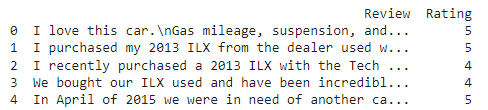
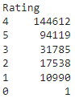
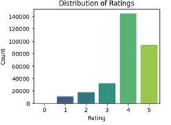
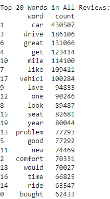
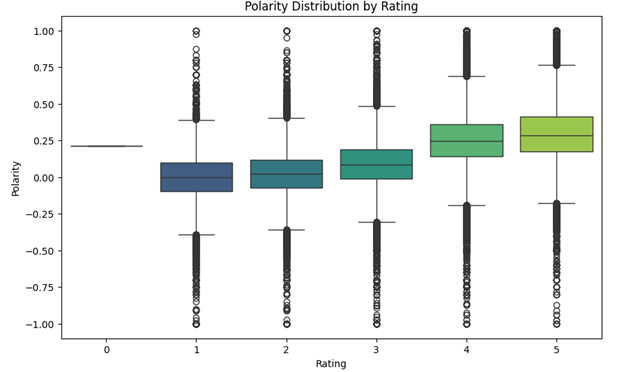

# Exploratory Data Analysis (EDA) Report: Car Reviews Dataset

## Introduction

The Car Reviews Dataset contains customer reviews for different cars, with ratings ranging from 1 to 5. The goal of this EDA is to better understand the characteristics of these reviews, explore word usage across ratings, and evaluate the polarity of each rating category. The insights drawn from this analysis will guide subsequent sentiment classification tasks.

---

## Part A: Dataset Overview

### How the dataset looks

- **Columns**:
  - `Rating`: Integer values between 1 and 5.
  - `Review`: Contains text data.

### Class Frequencies

The dataset is imbalanced, with **Rating 4** comprising more than 50% of the data points. This indicates that customers are mostly satisfied with their car purchases, likely due to significant research undertaken before buying a car.

### Class-wise Review Lengths

Descriptive statistics were calculated on review lengths, grouped by rating, to analyze if satisfaction levels affect the length of reviews. The box plot below summarizes these statistics:

---

## Part B: Text Analysis

### Word Frequency Analysis

Using a custom preprocessing function, stopwords were removed and words were stemmed to focus on essential terms. Below are the top 20 most frequent words across all reviews:

**Key Observations**:
- Words like `drive`, `mile`, `comfort`, and `time` are frequent. However, these results are influenced by the dataset's imbalance, with **Ratings 4 and 5** dominating.
- To account for this, word frequency by ratings was analyzed and visualized using word clouds.

### Word Frequency by Ratings

#### Visualized using Word Clouds:

  

**Key Observations**:
-	Words like ‘issue’ and ‘problem’ only appear after Ratings of 3 and lower. 
-	We can see some bi-grams stand out like ‘fun drive’ in Ratings 4 and 5, ‘engine issue’ in Rating 1, etc. This means that use of n-grams could be fruitful for our project.
-	As the ratings go lower, the relative frequency of the words like cars and vehicles goes up - however, this could be due to the fact that we have significantly less data about the lower ratings.  

---

## Part C: Review Polarity Analysis

Polarity scores were calculated for each review using TextBlob, ranging from -1 to 1:
- **-1**: Indicates negative sentiment.
- **1**: Indicates positive sentiment.
  

### Observations:
- Immediately, we can see that multi-class classification is going to be a challenge for this dataset. Even when Rating of 1 is supposed to be the ‘worst’ rating possible, the sentiment expressed by reviewers is not very negative - a burden of professional speech. 
- Polarity values range between `0` to `0.5`, suggesting challenges in distinguishing ratings.

---

## Conclusion

Key findings from the EDA:
1. **Class Distribution**: Skewed towards higher ratings, which could impact model performance.
2. **Text Characteristics**: Positive and negative reviews have distinct terms and bi-grams.
3. **Sentiment Consistency**: Polarity scores align with ratings but highlight challenges in multi-class classification.

These insights will guide feature selection, class definitions, and algorithm choices in the next phase of sentiment classification. By understanding the nuanced language in reviews, we can optimize model accuracy across rating levels.
